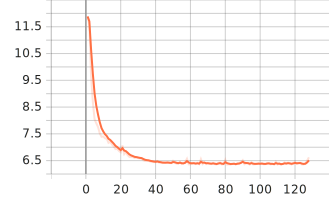
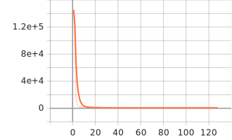
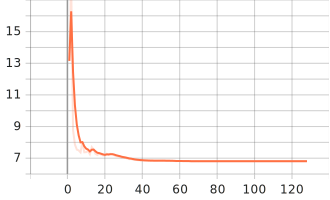
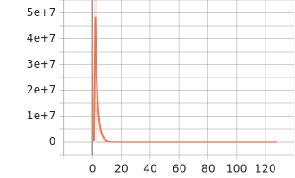
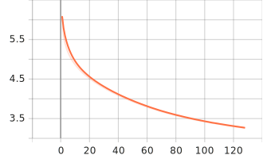
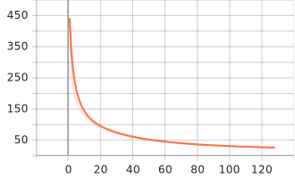
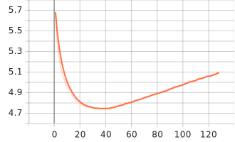
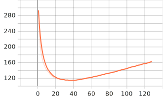
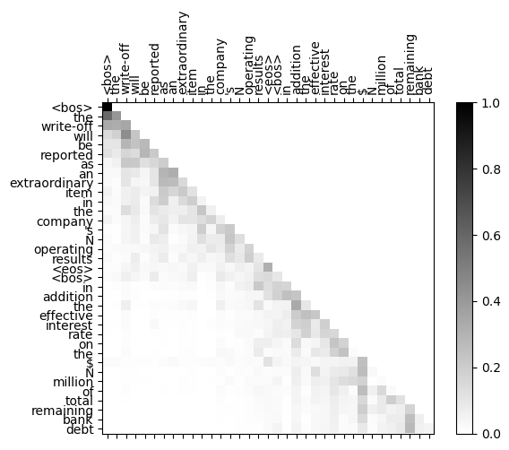
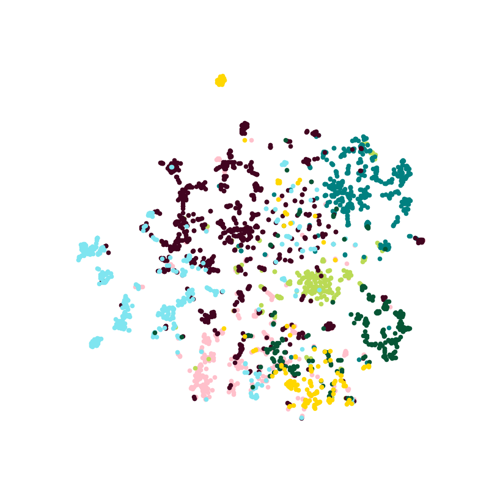

# Deep Learning HomeWork 3
> RNN&transformer implementation is in model.py
> RNN: python main.py 
> Transformer: python transformer.py
> DeepGCN: python DeepGCN.py


## RNN & Transformer
### Task A
use GRU with 2 1500D hidden layers.
#### training

loss:



perplexity:



#### validation

loss:



perplexity:



### Task B

use decoder-only structure like GPT. The decoder is composed with 6 decoder layer. the number of head is 8. the hidden dimension of the feedforward layer is 2048. the dimension of word embeddings is 512. 

#### training

loss:



perplexity:



#### validation

loss:



perplexity:



### Difference between preprocessing text and image 

- we need to `tokenize the text` when we proprocess the text data, because the text can not be easily converted to the number(or in other words, the tensor). we can not simply use the alphabet to represent a word. because every word has a meaning and the meaning is not relevant to the order of the letters. AS a result, we use a number(id) to represent a word, which is called `tokenize`.
- when we preprocess the image data. we nearly do not change the form of the picture. we just need to `tranform` the IMG file into a `tensor`, sometimes we need to `flatten the tensor`, `normalize the tensor`, `image augmentation` or some special technologies.
- we need to add a sign to represent `the start/end of the sentence` (`<eos>`) to let the AI know the where the sentence is becuase the sentences often have `different lengths`. while the image can be easily converted to the same-size ones.

### How Masks work
- mask is used in Transformer to keep it autoregressive. Unlike RNN, we use the `whole sequence` as the input of the transformer decoder input, which means if we do not use masks, the decoder will `see what it should predict`. That is a easy & meanless task, because the decoder have already know what it should predict while the output nearly equals to the input.
- the mask is implements as following. We use the `upper triangular matrix` as the mask and the fill the attention score of the mask element with almost `-inf` before the softmax layer. As a result, the attention score will almost be zero which means the decoder will not see the future knowledge. 
``` python
def get_attn_pad_mask(seq_q, seq_k, pad_idx: int = 0, device=torch.device('cpu')):
    # pad mask的作用：在对value向量加权平均的时候，可以让pad对应的alpha_ij=0，这样注意力就不会考虑到pad向量
    """这里的q,k表示的是两个序列(跟注意力机制的q,k没有关系)例如encoder_inputs (x1,x2,..xm)和encoder_inputs (x1,x2..xm)
    encoder和decoder都可能调用这个函数,所以seq_len视情况而定
    seq_q: [batch_size, seq_len]
    seq_k: [batch_size, seq_len]
    seq_len could be src_len or it could be tgt_len
    seq_len in seq_q and seq_len in seq_k maybe not equal
    """
    batch_size, len_q = seq_q.size()  # 这个seq_q只是用来expand维度的
    batch_size, len_k = seq_k.size()
    # eq(zero) is PAD token
    # 例如:seq_k = [[1,2,3,4,0], [1,2,3,5,0]]
    # [batch_size, 1, len_k], True is masked
    # print(pad_idx)
    pad_attn_mask = seq_k.data.eq(pad_idx).unsqueeze(1)
    # [batch_size, len_q, len_k] 构成一个立方体(batch_size个这样的矩阵)
    return pad_attn_mask.expand(batch_size, len_q, len_k).to(device)


def get_attn_subsequence_mask(seq, device=torch.device('cpu')):
    """
    seq: [batch_size, tgt_len]
    """
    attn_shape = [seq.size(0), seq.size(1), seq.size(1)]
    # attn_shape: [batch_size, tgt_len, tgt_len]
    subsequence_mask = np.triu(np.ones(attn_shape), k=1)  # 生成一个上三角矩阵
    subsequence_mask = torch.from_numpy(subsequence_mask).byte()
    return subsequence_mask.to(device)  # [batch_size, tgt_len, tgt_len]


scores = scores.masked_fill(attn_mask, -1e12)

```

### Attention Visualization

    randomly choose a sequence and visualize the attention map. The figure shows as following.



as we can see in the figure. a token will always focus on the tokens before it. Specially the dollar sign `$` has a high attention score in almost all the tokens after it.

### Ablation Study
   
The `multi-head attention module` contributes most to the excellent result.


## GNN

### Task A
We will show some last results of these different GNNs in following parts.

#### GCN
    Epoch: 190, Train: 1.0000, Val: 0.7880, Test: 0.8030
    Epoch: 191, Train: 1.0000, Val: 0.7880, Test: 0.8030
    Epoch: 192, Train: 1.0000, Val: 0.7880, Test: 0.8060
    Epoch: 193, Train: 1.0000, Val: 0.7880, Test: 0.8060
    Epoch: 194, Train: 1.0000, Val: 0.7900, Test: 0.8070
    Epoch: 195, Train: 1.0000, Val: 0.7900, Test: 0.8060
    Epoch: 196, Train: 1.0000, Val: 0.7900, Test: 0.8100
    Epoch: 197, Train: 1.0000, Val: 0.7880, Test: 0.8090
    Epoch: 198, Train: 1.0000, Val: 0.7880, Test: 0.8080
    Epoch: 199, Train: 1.0000, Val: 0.7880, Test: 0.8080
    Epoch: 200, Train: 1.0000, Val: 0.7880, Test: 0.8080
    
The acc in Test Set is about 0.8080

#### GAT
    Epoch: 190, Train: 0.9929, Val: 0.8040, Test: 0.8250
    Epoch: 191, Train: 0.9929, Val: 0.8080, Test: 0.8280
    Epoch: 192, Train: 0.9929, Val: 0.8100, Test: 0.8310
    Epoch: 193, Train: 0.9929, Val: 0.8060, Test: 0.8310
    Epoch: 194, Train: 0.9929, Val: 0.8060, Test: 0.8300
    Epoch: 195, Train: 0.9929, Val: 0.8060, Test: 0.8290
    Epoch: 196, Train: 0.9929, Val: 0.8020, Test: 0.8310
    Epoch: 197, Train: 0.9929, Val: 0.8000, Test: 0.8300
    Epoch: 198, Train: 0.9929, Val: 0.8020, Test: 0.8290
    Epoch: 199, Train: 0.9929, Val: 0.8000, Test: 0.8260
    Epoch: 200, Train: 0.9929, Val: 0.8020, Test: 0.8250
    
The acc in Test Set is about 0.8300

#### node2vec
    Epoch: 090, Loss: 0.8249, Acc: 0.7090
    Epoch: 091, Loss: 0.8243, Acc: 0.7100
    Epoch: 092, Loss: 0.8252, Acc: 0.6990
    Epoch: 093, Loss: 0.8248, Acc: 0.6980
    Epoch: 094, Loss: 0.8251, Acc: 0.6990
    Epoch: 095, Loss: 0.8247, Acc: 0.7040
    Epoch: 096, Loss: 0.8251, Acc: 0.6980
    Epoch: 097, Loss: 0.8248, Acc: 0.7070
    Epoch: 098, Loss: 0.8253, Acc: 0.7040
    Epoch: 099, Loss: 0.8234, Acc: 0.6980
    Epoch: 100, Loss: 0.8247, Acc: 0.7000
The acc is about 0.7000

The visual figure of the node2vec result after tSNE.


### Task B
We implement DeepGCN & test it in the same dataset.

```python
class DeepGCN(torch.nn.Module):
    def __init__(self,num_node_features, num_edge_features ,num_node_classes ,hidden_channels, num_layers):
        super().__init__()

        self.node_encoder = nn.Linear(num_node_features, hidden_channels)
        if num_edge_features is not None:
            self.edge_encoder = nn.Linear(num_edge_features, hidden_channels)

        self.layers = torch.nn.ModuleList()
        for i in range(1, num_layers + 1):
            conv = GENConv(hidden_channels, hidden_channels, aggr='softmax',
                           t=1.0, learn_t=True, num_layers=2, norm='layer')
            norm = nn.LayerNorm(hidden_channels, elementwise_affine=True)
            act = nn.ReLU(inplace=True)

            layer = DeepGCNLayer(conv, norm, act, block='res+', dropout=0.5,
                                 ckpt_grad=i % 3)
            self.layers.append(layer)

        self.lin = nn.Linear(hidden_channels, num_node_classes)

    def forward(self, x, edge_index, edge_attr):
        x = self.node_encoder(x)
        if edge_attr is not None:
            edge_attr = self.edge_encoder(edge_attr)
        else:
            edge_attr = None

        x = self.layers[0].conv(x, edge_index, edge_attr)

        for layer in self.layers[1:]:
            x = layer(x, edge_index, edge_attr)

        x = self.layers[0].act(self.layers[0].norm(x))
        x = F.dropout(x, p=0.1, training=self.training)

        return self.lin(x)
```
`dim_hidden set to 64 and the num_layer set to 28`

    Epoch: 190, Train: 1.0000, Val: 0.7100, Test: 0.7410
    Epoch: 191, Train: 1.0000, Val: 0.7080, Test: 0.7410
    Epoch: 192, Train: 1.0000, Val: 0.7060, Test: 0.7390
    Epoch: 193, Train: 1.0000, Val: 0.7040, Test: 0.7390
    Epoch: 194, Train: 1.0000, Val: 0.7040, Test: 0.7360
    Epoch: 195, Train: 1.0000, Val: 0.7040, Test: 0.7350
    Epoch: 196, Train: 1.0000, Val: 0.7040, Test: 0.7360
    Epoch: 197, Train: 1.0000, Val: 0.7040, Test: 0.7360
    Epoch: 198, Train: 1.0000, Val: 0.7040, Test: 0.7380
    Epoch: 199, Train: 1.0000, Val: 0.7060, Test: 0.7370
    Epoch: 200, Train: 1.0000, Val: 0.7040, Test: 0.7380

The acc in Test Set is about 0.7380.